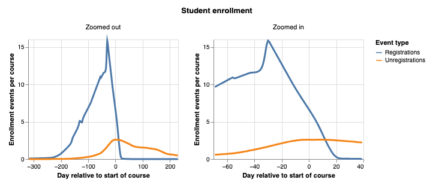
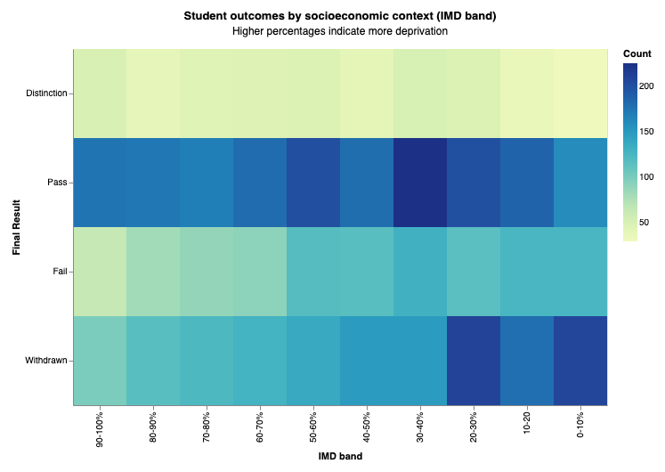
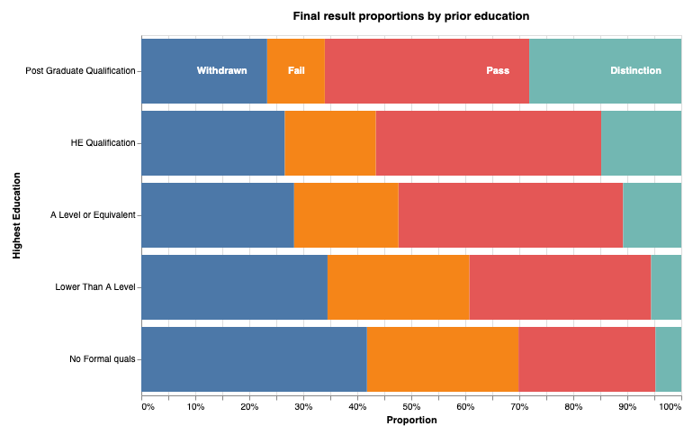

# **Brian Mabry Edwards**

**Data Analyst | Software Engineer**  
Waco, Texas | 512-584-6841 | brian.mabry.edwards@gmail.com  
[LinkedIn](https://linkedin.com/in/brian-mabry-edwards)

---

## **Featured Data Project**

### Student Learning Analytics Dashboard | UK School System Analysis | 2025

Comprehensive analysis of student performance patterns across multiple dimensions using open educational data.

**Technical Implementation:** Built end-to-end data pipeline analyzing enrollment patterns, assessment scores by subject, socioeconomic factors, and feature importance for student outcomes. Developed predictive models identifying key factors affecting student success including prior education levels and regional demographics.

**Technologies:** Python, pandas, scikit-learn, altair, XGBoost classifier

[**View Code & Analysis**](https://colab.research.google.com/drive/1KLyhkvlwP2dWZrVcqOFciJIA9QWcoGlm)

---

## **Core Competencies for Data Engineering**

**Data Pipeline Development:** ETL/ELT processes, data integration across multiple systems

**Educational Analytics:** Student performance tracking, predictive modeling, visualization

**Technologies:** Python, SQL, PostgreSQL, AWS (experienced), Azure (eager to learn), Power BI

**Data Governance:** Quality assurance, compliance, secure handling of sensitive data

**Knowledge Transfer:** Technical documentation, mentoring, translating complex data

## **Professional Experience**

### Undertow Ink | Waco, TX

Founding Creator | 2021–2025 (current)

Built and led a multifaceted creative platform that educated and inspired through writing, design, and implementation of digital media projects. Taught technical and artistic skills via authored content and implemented sophisticated design systems.

* Developed and maintained undertow.ink, curating literary & speculative fiction reviews, essays, and thematic "picks" and designing the site architecture.  
* Created and maintained a technical blog to share tutorials, code walkthroughs, and deep dives into software development practices.  
* Authored frequent issue-based essays and reflective writing for Substack.  
* Produced and published coding solutions, datasets, discussion pieces, and competitive submissions via Kaggle, enhancing analytical thinking.

### Atlassian | Austin, TX

Senior Software Engineer, Cloud Service | 2015–2021

Built and maintained data infrastructure for Bitbucket Cloud serving 10+ million developers.

* Architected scalable data pipelines using Django/PostgreSQL, improving system reliability  
* Created comprehensive technical documentation and training workshops, reducing onboarding time by 40%  
* Mentored global engineering teams on AWS best practices and data architecture  
* Developed webhook systems handling thousands of third-party integrations

### 21CT | Austin, TX

Senior Software Engineer, Data Analytics | 2013–2015

Engineered healthcare fraud detection platforms using pattern recognition and statistical analysis.

* Built Python-based pattern recognition systems processing millions of medical claims  
* Developed algorithms to identify statistical anomalies in large datasets  
* Created documentation translating technical findings for non-technical stakeholders  
* Implemented secure APIs for HIPAA-protected data handling

### Zenoss | Austin, TX

Senior Software Engineer, Network Monitoring | 2008–2013

Developed enterprise IT monitoring solutions analyzing thousands of network endpoints.

* Built real-time data dashboards and correlation engines  
* Created administrator guides making complex system data interpretable  
* Led technical training sessions for engineers and customers

### Florida Blue — Jacksonville, FL

Network Engineer | 2005–2008

Designed and implemented enterprise network architecture supporting healthcare operations. Automated network configuration management and developed security protocols.

### Juniper Networks — Sunnyvale, CA

Technical Support Engineer | 2000–2005

Provided tier-3 engineering support for Internet Service Providers managing backbone infrastructure. Specialized in BGP and multicast routing optimization.

* Diagnosed and resolved critical network outages affecting millions of users  
* Developed training materials and delivered technical presentations on routing protocols  
* Co-authored "Interdomain Multicast Routing" (Addison-Wesley, 2002\)  
* Earned CCIE and JNCIE certifications, demonstrating expert-level networking knowledge

### ExxonMobil — Houston, TX

Network Engineer | 1997–2000

Implemented Cisco-based enterprise networks and developed security frameworks. Created technical documentation and training programs for IT staff.

## 

## **Other Educational Technology & Data Science Projects**

**Machine Learning Applications**

* [Kaggle competitor](https://www.kaggle.com/brianedwards/code): Applied predictive models to NCAA tournament data (March Machine Learning Mania 2025\)  
* Implemented neural networks from scratch including transformer architectures  
* Published technical tutorials on data analysis and model optimization

**Power BI Certification** | 2024

* Completed comprehensive business intelligence training  
* Created interactive dashboards for data visualization

**Technical Knowledge Sharing**

* Maintain [technical blog](https://bedwards.github.io/technical-blog/) with 50+ articles on data engineering and machine learning  
* Produce educational content explaining complex data concepts for general audiences  
* Active participant in Project Euler (125+ problems solved)

---

## **Education**

**B.S. Computer Engineering** | University of Florida | 1997  
**Freshman Coursework** | United States Air Force Academy | 1994

---

## **Certifications & Publications**

* Power BI Data Analyst (2024)  
* [Cisco CCIE \#6187](https://hofccie.weebly.com/) | Juniper JNCIE  
* Co-author: [Interdomain Multicast Routing](https://www.oreilly.com/library/view/interdomain-multicast-routing/0201746123/) (O'Reilly/Addison-Wesley, 2002\)  
* Contributing author to IETF specifications
